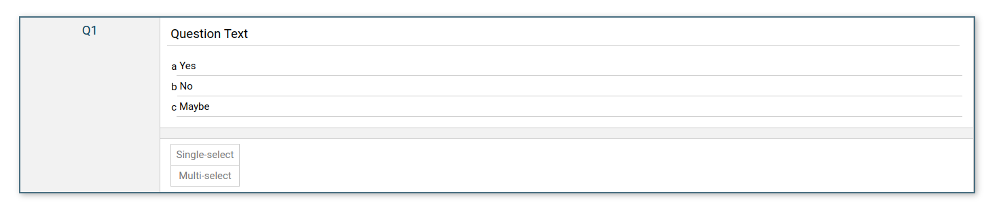

# IncQuery coding task

- Audience: IncQuery internal
- Author: Jae Perris jae@incquery.com
- Date Created: 15-Feb-2024

## Introduction

We want to get a feel for your style of design and problem solving through programming. It is not a test, and meant to be a bit of fun. We'll look both on output (the code), as well as the outcome (the UI and UX) that you deliver to get to know you a bit better.

Our team values readability primarily. You may create additional components, styles, and files as you see fit.

The task is designed to take 2-4 hours, but we have not dry-run it yet. Let us know if you have any issues, or feedback and we will try to both accommodate you and adjust it for future uses. Don't spend too much time on it. Quality over quantity.

You are not expected to complete all of the steps. If you do get stuck, feel free to leave a write up of your ideal design and approach to solving it. We all get stuck sometimes :).

We've chosen React, Javascript, CSS, and HTML as the web stack. We use Vite here to provide the dev server and hot reloading.

### Tips

- Please don't copy-paste solutions from AI assistants.
- You should not need to use JQuery.
- If you reach for `.querySelector()` or `.getElement()`, try first see if there's a way in react to do it instead.
- The configurable parts of the interface don't need to save their state across browser refreshes.

## Dependencies

You may need to contact DKB to install this software.

### Node.js & npm

Download and install node and npm https://nodejs.org/en/download

Verify by opening a terminal window and typing `node --version` and `npm --version`. You should see version numbers for both. Ensure your node version is 18+.

### VS Code

Download and install vscode https://code.visualstudio.com/download

## Setup & Run

1. Open this folder in vscode
2. Open your terminal in vscode
3. Install the projects dependencies with `npm install`. Verify by seeing something like `added 82 packages, and audited 83 packages in 591ms`
4. Open the web-server with`npm run dev`.Verify by seeing something like: `Local: http://localhost:5173/`
5. Open that link with your web browser. The elements on this page are deliberately not functional. Verify by seeing: 

If you've gotten this far, you can try edit the contents of `QuestionEditor.jsx`. Once you save the file, the web browser should immediately update with your changes.

## Scenario

You are working as an engineer writing code for the top primary research tools provider for survey insights.

!! You receive an email

```
From: QuestionnaireAdministrant@CorpInsights.com

Engineer,
I thought it would be lovely if we were able to edit the question text of a question.

Regards,
QA
```

You love that your product is in the hands of users committed to improving our offering and take up the challenge. You create an issue on Gitlab to track the request. Then, since, you're just finishing up another task, you get started.

It seems that our front-end library (react) that helps us render HTML in the browser and manage interactions supports the requested feature by offering state-managing for components. You decide to add this to the `<input value="Question Text" readOnly />` element which. It appears they now support changing the text in elements. This is great. You look up the [docs](https://legacy.reactjs.org/docs/hello-world.html) to see if you can figure it out.

### Your tasks unfold as follows:


1. ~~**Make the question text editable**: You start by ensuring the question text in the input field can be edited, allowing users to modify questions directly within the tool. You set a limit of 255 characters on the text, and show the user how many characters remain on their budget.~~
2. ~~**Implement the question mode toggle**: Soon after, you realize the importance of selecting question modes single-select or multi-select modes and implement the logic.~~
3. **Report a mismatch between question text contents and question mode**: As you delve deeper, the potential for mismatches between the question text and the selected question mode becomes apparent. Addressing this, you implement a feature to report possible inconsistencies, guiding users to create more coherent and effective surveys. For example if the text "select all that apply" appears and the question is single-select, that would indicate an error.

### Stretch goals:

4. ~~**Make the choice items editable**: The ability to edit the text of choice items directly within the editor is identified as another critical feature. This capability allows for more nuanced answer options.~~
1.  ~~**Implement add, remove choice items**: Lastly, recognizing the diverse needs of different surveys, you work on making the number of choice items configurable. Instead of placeholder text in new elements, you decide to use the last item's text.~~

## Submission

Once you're done please create a zip folder with all of the contents of this folder, except your node_modules folder and submit to Randeep randeep@incquery.com
